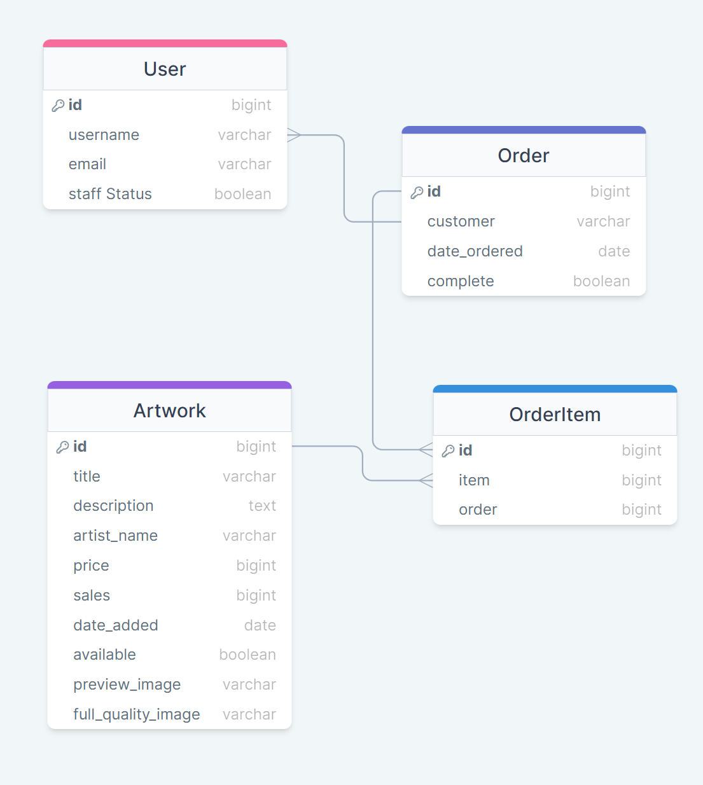
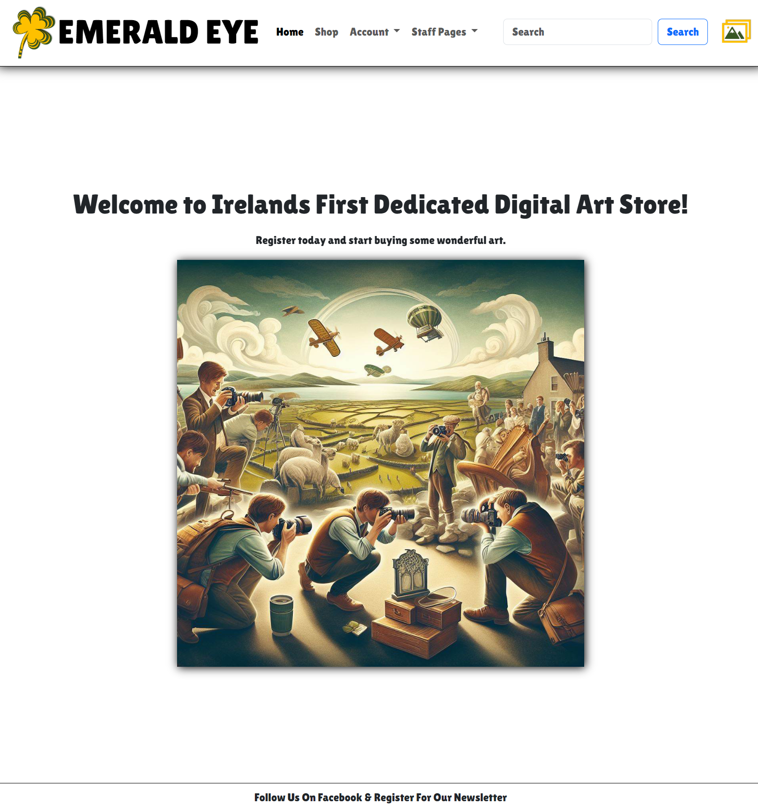
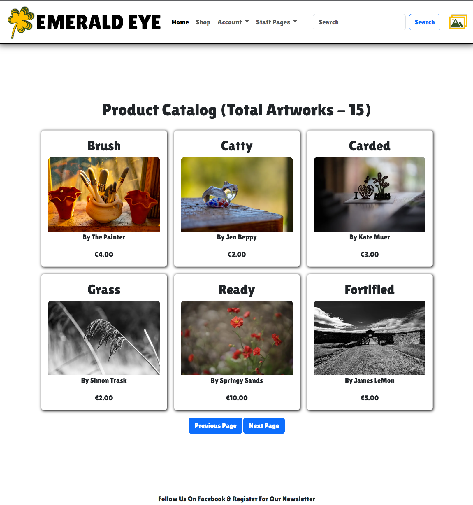
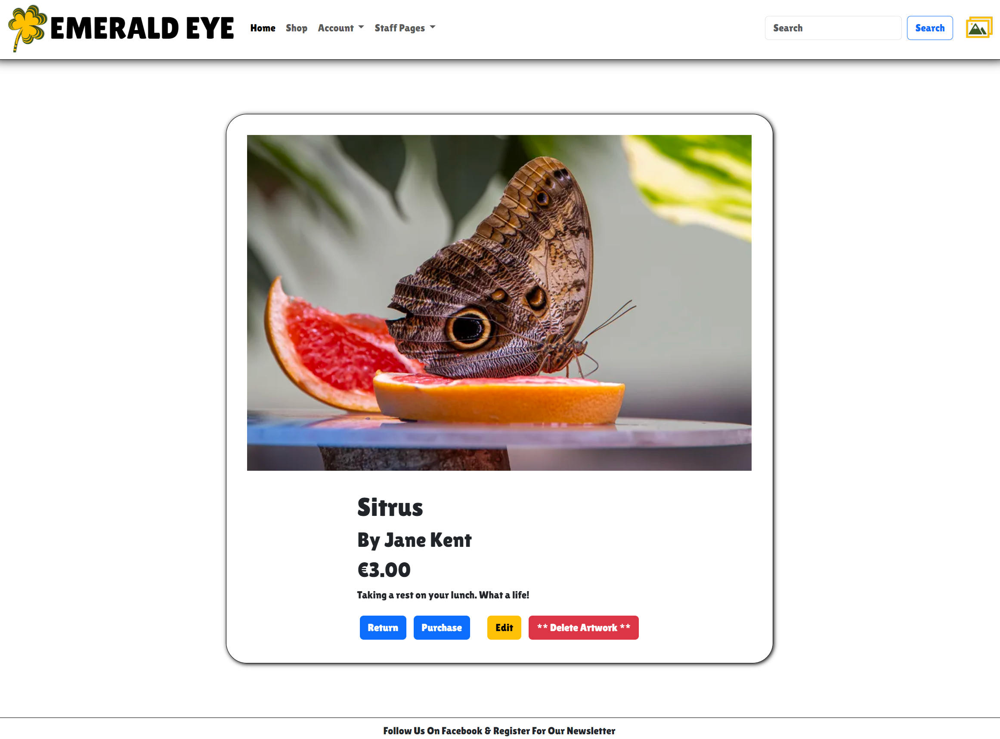
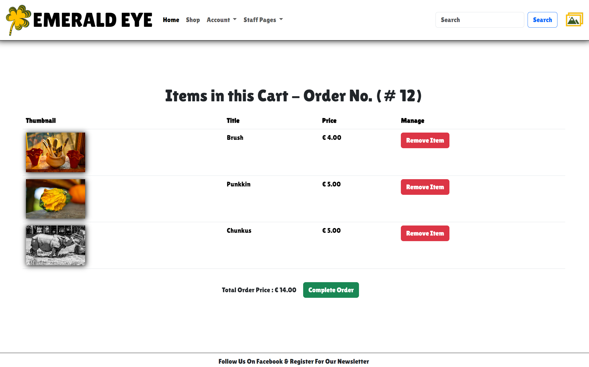
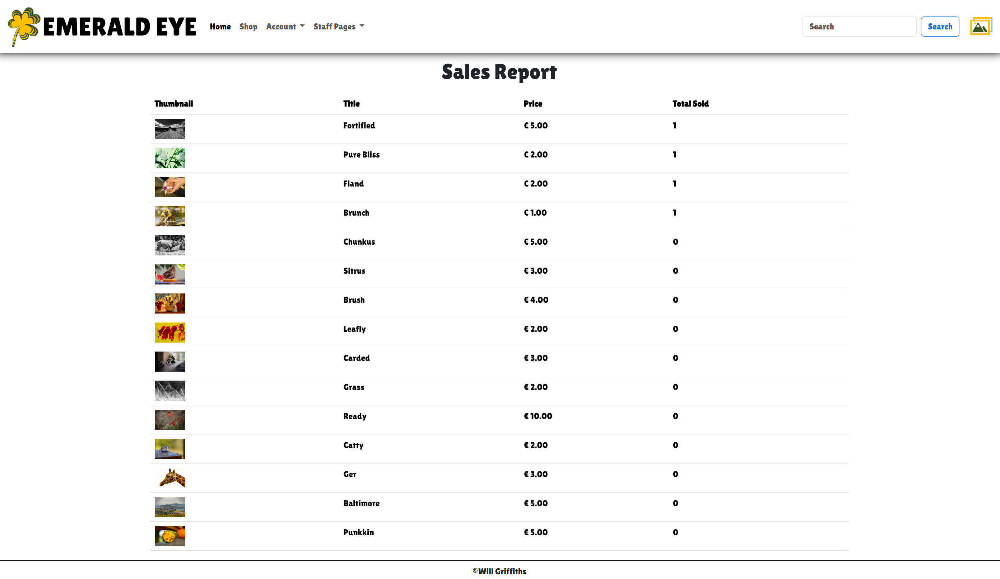
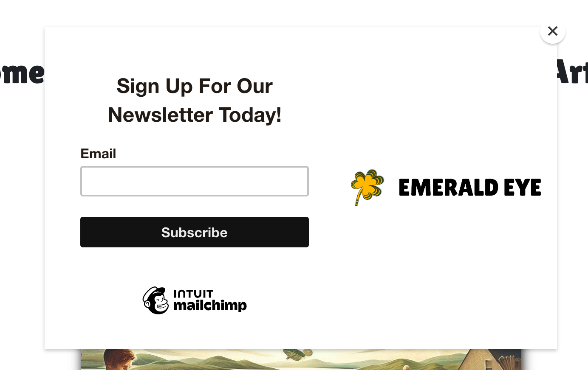
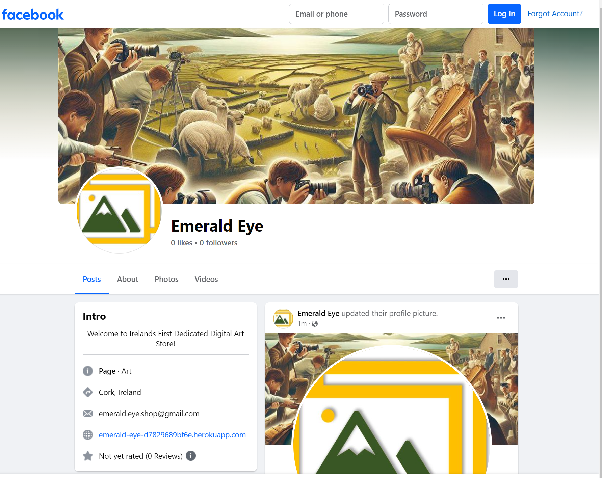

# Emerald Eye

## Site Summary

Are you a photographer who wants to share your talent and passion with the world? Do you dream of turning your hobby into a source of income? If so, you need to check out Emerald Eye, the ultimate platform for Irish photographers. 

Emerald Eye is a website that allows up and coming photographers across Ireland to sell their ditial work. Whether you specialize in breathtaking landscapes, captivating portraits, or anything in between, Emerald Eye can help you reach a global audience of buyers who appreciate your art. 

Emerald Eye is more than just a marketplace. It is a community of artists who support each other and celebrate the beauty of Ireland. You can showcase your portfolio and discover new inspirations. 

Emerald Eye takes care of everything for you. Our inovative digital first approach lets Artists reach a wider auidence while still generating a revenue stream to support their efforts . All you have to do is send us your photos, set your prices, and wait for the orders to come in. Emerald Eye handles the rest and only takes a minor commisiion to support the running costs of the site. 

Emerald Eye is the perfect opportunity for you to turn your passion into profit. Join Emerald Eye today and let the world see Ireland through your eyes. 

[Visit the deployed site here](https://emerald-eye-d7829689bf6e.herokuapp.com/)

** **NOTE** **

This site is purely a demo and no charges are incurred.
To make a test purchase use the card number 4242424242424242 with any future expiry date and any 3 numbers for the ccv

## Commercial Viability (Business Model) 

People like good photos, they tell stories, they stir emotions, they connect us with things we love. 

The business model for Emerald Eye is to be a frictionless environment for artists to sell their work. The hook is that this site is for Irish artists promoting images taken in Ireland, all purely in digital format. 

The upfront costs with this business are low since it will be entirely web based and hosting costs will really only increase with site traffic (and sales) 

The desire for printed artwork, and the associated costs, has lessened in favor of high resolution digital files that allow for a custom experince displayed on devies such as LGs Art Tv's. Emerald Eye seeks to capitialise on these desires for more high quality conentent at an affordable price.

## Agile Planning

All user story planning and acceptance criteria can be viewed on the [connected project here.](https://github.com/users/Will-Griffiths-Ireland/projects/4/views/2)

## Site Design

The overall design of the site is tailored towards minilism and focusing on the art itself. Initially I was going to allow users to just upload as many images as they wanted directly, but this raised concerns over inaproriate content and a flood of low quality content. The approach I decided on was a more curated and personal touch, much like a small art gallery.

Due to time constraints this is very much an MVP storefront that was built rapidly but still aims to be fully functional and meet all pass criteria.

### Wireframes

The site follows a classic approach and the wireframes were the intitial concept that I knew would align with a trnaditional store format and would be qucik to implement with bootstrap.

The pdf can be found [here](assets/docs/Wireframes.pdf)

### Color Schemes

The colour scheme of the site leans heavily on the colours of the Irish flag

Green - #385723
White = #ffffff
Gold - #ffc000

### Fonts

* I landed on using the 'Lilita One' font, it really just came from testing out multiple fonts till I found one that had the right vibe for the site
* sans serif is the fallback

### Database Schema

I used a highly optimized and performant schema that spans 4 tables.

## Site Features

The site might be simple but packs in all the critical features to enable a successfull go-live.

* Simple navigation
* User Authentication
* Dymanic add/edit/delete of art by staff from site interface
* Product listing
* Product Search
* Product Detail
* Automatatic order creation and cart persistence
* Full stripe intergration with dynamic pricing
* Email confirmations with assest delivery
* Staff sales data report

### Logo & Navigation

* Top left is the sites logo.
* Menu items are displayed depending on authetication state
* Staff pages restricted to staff only
* Search input
* Images cart

### Main Landing Page

* A simple page welcomes users to the site
* Platform for future deals and showcases
* Splash image is to make the sites purpose clear

### Account Management

** NOTE ** This site is not security hardened since its in a test/demo state. Email verification is not enabled to allow for easy testing/review. A production site would have this enabled.

* Menu will display register and sign in options if use is not authenticated
* If authenticated menu will display sign out (USER)
* All the different views on the site are driven through authenication status and only relevant options are displayed

### Message Notifications

* All imporant actions across the site such as user authentication or adding art to the cart will result in onscreen notifications.
* These fade away after a few seconds

### Shop

* The main shop page displays art cards of the products
* 6 items per page
* Full pagination with total
* Clicking takes you to the details of that item
* User that are not authenticated can browse all items (to entice them to register and purchase) but the purchase button is one to register

### Search

* In the navigation bar users can enter search critera.
* Artwork with matching text in the title or description is then displayed

### Art Details

* Displays larger preview image
* Diplays details of item
* Buttons for Purchase / Edit / Delete displayed based on the authentication level of the user
* Purchase Button adds item to the users cart and takes them to it

### Art Edit & Deletion

* Staff have edit and delete buttons
* Edit allows alteration of item
* Setting available to false will hide the item
* Deletion has strong confirmation warning

### Purchase List (Cart)

* The users cart displays all the current items they have and the prices/total
* The user can remove items
* The user can complete the purchase

### Payment

* Payment is handled via stripe and the price is calcualted based on all the items in the cart
* The user email address is passed to the checkout

To make a test purchase use the card number 4242424242424242 with any future expiry date and any 3 numbers for the ccv

### Order Confirmation & Digital Delivery

* The user will be sent back to the site and the success page that confirms the order was processed.
* The order gets marked completed
* The items have their sales increased
* An email is sent to the user which confirms the purchase 

### Sales Report

* I created a basic reporting page as an example of future enhancements
* It displays all the art by the number of sales

## Marketing

* The site has a related facebook page
* A call to action in the footer asks users to follow on facebook for the newsletter
* Newletter service implemented with Mailchimp, onscreen pop-up calling for signup and also a link to signup in the page footer

## Testing

All details on testing can be found [here](TESTING.md)

## Technologies & Tools

* Github & Codespaces (Ubuntu 22.04.2 LTS)
* Python 3.8.12
* Bootstrap 5.3
* Jquery 3.7.0
* Django 3.2.19
* HMTL 5
* CSS 3
* Javascript
* DrawSQL
* Adobe photoshop
* MS Powerpoint
* Heroku
* stripe.com
* cloudinary.com
* elephantsql.com
* gmail.com

## Packages

You can check all the packages/libs and their versions in the [requirements.txt](requirements.txt)

## Deployment

Below is a general guide for deploying this application yourself.

There are many options for PaaS, database hosting services, and file hosting services. If you use different providers to me then you will need to configure [emerald_eye/settings.py](emerald_eye/settings.py) further to what I mention below and need to refer to the relevant [Django documentation](https://docs.djangoproject.com/en/3.2/) for the correct settings.

Ideally connect your forked repo with a cloud based IDE like Codespaces/Gitpod/Codeanywhere and use a linux based container/workspace.
This repo is built on template the code institue developed (.devcontainer) that works well with Codeanywhere and triggers a build of the base enviroment (Ubuntu 22.04.2 + python 3.8)

* Fork the github repo (recommended) or clone the repo locally
* Setup your cloud enviroment 
* Install all the required packages ( just run the command __pip install -r requirements.txt__ )
* Setup an account and a new database on https://www.elephantsql.com/
* Update the DATABASE dictionary in settings.py to point to your HOST/NAME/USER
* Setup an account on http://www.Cloudinary.com
* Create an env.py in your projects root and add it the .gitignore file,then add the below code with these settings
* Update the secret key with a random string of your choosing, and update the elephantsql DB_PASSWORD with your own, finally put your own cloudinary connection url in
>import os
>os.environ['SECRET_KEY'] = '--UNIQUE SECRET KEY--'  
>os.environ['DEV'] = 'True'  
>os.environ['CLOUDINARY_URL'] = '--URL TO ACCESS CLOUDINARY--'  
>os.environ['DB_PASSWORD'] = '--PASSWORD FOR DB CONNECTION--'

* Run a django migration (python manage.py migrate) to create the tables on your database
* Create an account on Heroku and create a new app
* Update the apps settings with config vars that match those in the env file SECRET_KEY, CLOUDINARY_URL, DB_PASSWORD
* Deploy App 

## Future Enhancements

* The site is MVP so there is lots of room for improvement
* Exception and error handling would need work
* Sales Coupons
* Possible artist accounts with staff moderation
* Advanced finance and profit distribution

## Credits

* All test images used were my own
* AI was used to create the splash image on the index page 

